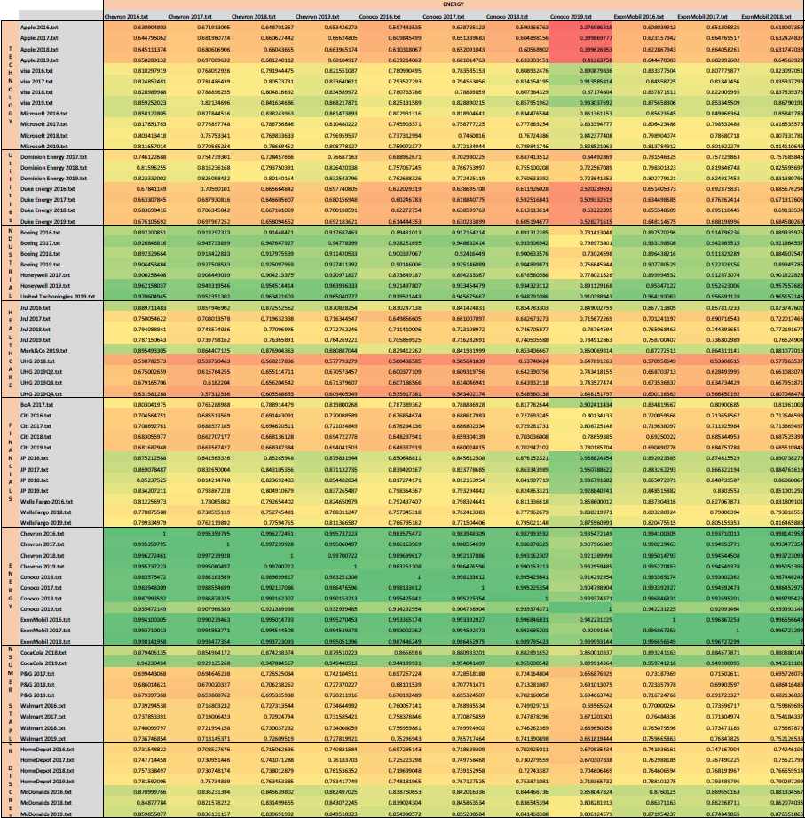
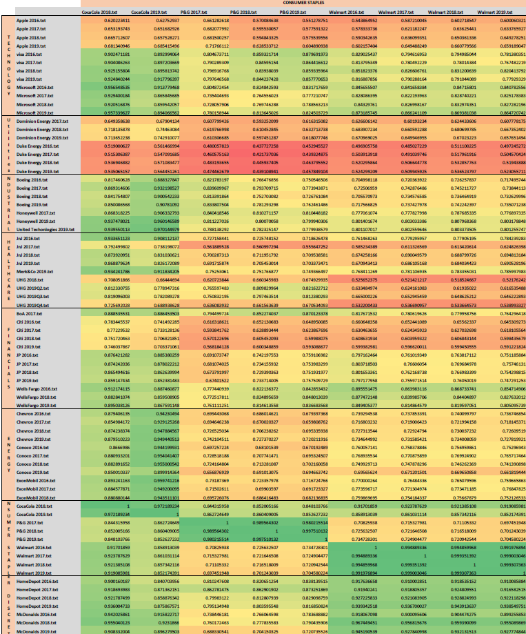

## Research Question ##

Anecdotal evidence indicated that there was immense similarity between public sustainability reports; therefore, there was possibility of 'boilerplate' disclosure. This leads to the following question:

*Research Question*: Is there 'boilerplate' disclosure unfolding in public sustainabiulity reports? If so, what is the nature of it?

The aim of this analysis is to provide evidence for this research question. This is a purely exploratory analysis, and does not support/debunk a particular hypothesis.

## Methodology ##

A broad-based approach was adopted. Sustainability reports for the past 4 years (where accessible) of the top 4 companies in each SnP500 sector were taken. The reporting environment was fairly arbitrary, some companies did not produce sustainability reports, while others issued them inconsistently. Companies that did not produce any reports were excluded from the analysis; while reports for those that issued inconsistently were included. In addition, there were timing issues. Some companies labelled their reports according to the year in which they were issued, whereas others labelled them according to the calender year they related to. These inconsistencies were taken into account, and standardised as per calender year. There was also variation in the reporting dates and frequency of issuance. There was no set month in which these reports came out, although most reports would be out within 6 months of the calender year. One company issued quarterly mini-sustainability reports, these were included in the analysis. The final sample contained 75 reports, across 23 companies and 8 sectors. 

The reports are hand-collected in pdf format from company websites and then converted to txt. files for analysis.

## Code ##

The analysis was conducted in R script, first all relevant packages were loaded onto the R session. 'LSAfun' and 'lsa' are sufficinet to conduct a thorough LSA analysis. A brief outline of process is as follows: 

 1. **Reading in Data**: All reports as txt. files were compiled into a single folder in local stoarge and read into r.
 
 2. **Removing stopwords, stemming and removing numerics**: A local dictionary available in the LSAfun package was used to remove stop words. Words were also 'stemmed' to avoid repeating of the same word in different forms. Lastly, all 'words' tha comprised solely of numbers were removed.
 
 3. **Creating the Term document matrix (TDM)**: A term document matrix has individual words as rows and documents as columns. Additional conditions were applied to filter words. Specifically, words had to appear at least 3 times within each document *and* 30 times across documents to be included in the TDM. This was done to ensure that only menaningful words were included in the analysis.
 
 4. **Weighting TDM**: Two weighting schemes were applied. These included the 'term frequency (TF)' and the 'TF-IDF'. The former weights words according to the frequency of their appearence within a document, whereas the latter does the same and downweights words according to their appearence across documents. For instance, a word would be weighted highest in a document when it appears a lot within that document but does not appear in other documents.
 
 5. **Applying LSA**: LSA words in a very similar manner to principal component analysis. Mathematically, it reduces dimentionality of the term space. The resulting matrix indicates document weighting across each of the components. Although the function allows custom setting the number of components, this was left to the algorithm.
 
 6. **Creating a Cosine Similarity Matrix**: Finally, our main variable of interest, cosine similarity, was generated based on the reduced-dimention matrix.
 
``` {r script, eval = F}
library(LSAfun)
library(lsa)
library(xtable)

dir <-'C:/Users/arkhan/OneDrive - The University of Melbourne/Desktop/
Honours Materials/Research Methods/Textual Analysis_BoQin/Reports/txt Master'

data("stopwords_en")
## Creating Term Document Matrix ##

TDM <- textmatrix(dir, stopwords =  stopwords_en, stemming = T, removeNumbers = T, 
                  minDocFreq = 3, minGlobFreq = 30)
## Weighting ##
TDM_1 <- lw_tf(TDM)
TDM_3 <- lw_tf(TDM) * gw_idf(TDM)

## Applying SVD/ Reducing dimentionality ##
LSA   <- lsa(TDM, dims = dimcalc_share())
LSA_1 <- lsa(TDM_1, dims = dimcalc_share()) 
LSA_3 <- lsa(TDM_3, dims = dimcalc_share()) 

## Labelling resulting vectors ##
tk <- t(LSA$sk * t(LSA$tk))
dk <- t(LSA$sk * t(LSA$dk))

tk_1 <- t(LSA_1$sk * t(LSA_1$tk))
dk_1 <- t(LSA_1$sk * t(LSA_1$dk))

tk_3 <- t(LSA_3$sk * t(LSA_3$tk))
dk_3 <- t(LSA_3$sk * t(LSA_3$dk))

## Identifier vectors for documents and terms ##
docs <- rownames(dk)
docs <- docs[c(1,2,3,4,64,65,66,67,52,53,54,55,24:30,6:9,38:39,63,40:43,51,59:62,5,
               14:17,44:47,72:74,10:13,20:23,31:33,18:19,56:58,68:71,34:37,48:50)]
terms <- rownames(tk)

docs_1 <- rownames(dk_1)
docs_1 <- docs_1[c(1,2,3,4,64,65,66,67,52,53,54,55,24:30,6:9,38:39,63,40:43,51,59:62,
                   5,14:17,44:47,72:74,10:13,20:23,31:33,18:19,56:58,68:71,34:37,48:50)]
terms_1 <- rownames(tk_1)

docs_3 <- rownames(dk_3)
docs_3 <- docs_3[c(1,2,3,4,64,65,66,67,52,53,54,55,24:30,6:9,38:39,63,40:43,51,
                   59:62,5,14:17,44:47,72:74,10:13,20:23,31:33,18:19,56:58,68:71,34:37,
                   48:50)]
terms_3 <- rownames(tk_3)

## Cosine similarity matrix ##
cosine <- multicos(docs, tvectors = dk, breakdown = F)
cosine_1 <- multicos(docs_1, tvectors = dk_1, breakdown = F)
cosine_3 <- multicos(docs_3, tvectors = dk_3, breakdown = F)


```
\newpage
## Results ##

### Bird's eye###

Anecdotal evidence suggested that sustainability reports covered similar topics within sectors. Below is a by-sector heat-map of the entire cosine similarity matrix. It shows that the highest cosine similarity is consistently observed in the diagonal, which indicates sustainability reports are similar (relative to the sample) within each sector. 

\begin{figure}[fig.pos]


It worth noting that the strength of this similarity varies across sectors. Notably, technology and consumer staples sectors exhibit slightly lower similarity.

### By Industry ##

#### Technology ####

The tecnology sector's disclosure is underdeveloped compared to other sectors. Major companies in the industry do not issue sustainability reports, notably Amazon. However, upon close examinaiton the low average is caused by very low similarity between Apple and others (see fig. ), therefore, an alternative explanation for this reusult might be that these companies have different business models, but happen to be classified under the same SnP500 sector. This is no anolmaly given that firms in a variety of industries have a tendency to be classified as 'technology firms'.

``` {r table tech, results = 'asis', fig.align = 'center', echo = F}

knitr::kable(cbind(c("Technology", "Utilities", "Industrials", "Healthcare", 
                     "Financials", "Energy", "Consumer Staples", 
                     "Consumer Discretionary"),
                   cbind(round(c(mean(cosine[1:12,1:12]), mean(cosine[13:19,1:12]),
                                 mean(cosine[20:26,1:12]), mean(cosine[27:35,1:12]),
                   mean(cosine[36:47,1:12]), mean(cosine[48:58,1:12]), 
                   mean(cosine[59:67,1:12]), mean(cosine[68:74,1:12])), 3))), 
             row.names = T, format = 'latex', booktabs = T, 
             caption = 'Average Similarity-Technology') %>%
  add_header_above(c("", "Technology" = 2)) %>% kable_styling(latex_options
                                                              = 'hold_position', 
                                                              font_size = 10)%>%
  row_spec(1, color = 'black', background = 'yellow')

```


#### Utilities ####

In utilities the similarity within sector is strong. There is a clear distinction between within and without sector reports (fig. ). The averages also echo this.

``` {r table utility, results = 'asis', fig.align = 'center', echo = F}

knitr::kable(cbind(c("Technology", "Utilities", "Industrials", "Healthcare", 
                     "Financials", "Energy", "Consumer Staples", 
                     "Consumer Discretionary"),
                   cbind(round(c(mean(cosine[1:12,13:19]), mean(cosine[13:19,13:19]),
                                 mean(cosine[20:26,13:19]), mean(cosine[27:35,13:19]),
                   mean(cosine[36:47,13:19]), mean(cosine[48:58,13:19]), 
                   mean(cosine[59:67,13:19]), mean(cosine[68:74,13:19])), 3))), 
             row.names = T, format = 'latex', booktabs = T, 
             caption = 'Average Similarity-Utility') %>%
  add_header_above(c("", "Utilities" = 2)) %>% 
  kable_styling(latex_options = 'hold_position', font_size = 10) %>%
  row_spec(2, color = 'black', background = 'yellow')

```


#### Industrials ####

Results support signifincat within sector similarity in industrials. Anecdotal evidence suggested that 'Boeing Company' there is a clear leader in this sector. Boeing has produced sustainability reports dating back to 2008!

``` {r table industrials, results = 'asis', fig.align = 'center', echo = F}

knitr::kable(cbind(c("Technology", "Utilities", "Industrials", "Healthcare", 
                     "Financials", "Energy", "Consumer Staples", "Consumer Discretionary"),
                   cbind(round(c(mean(cosine[1:12,20:26]), mean(cosine[13:19,20:26]),
                                 mean(cosine[20:26,20:26]), mean(cosine[27:35,20:26]),
                   mean(cosine[36:47,20:26]), mean(cosine[48:58,20:26]), 
                   mean(cosine[59:67,20:26]), mean(cosine[68:74,20:26])), 3))), 
             row.names = T, format = 'latex', booktabs = T, 
             caption = 'Average Similarity-Industrials') %>%
  add_header_above(c("", "Industrials" = 2)) %>%
  kable_styling(latex_options = 'hold_position', font_size = 10) %>%
  row_spec(3, color = 'black', background = 'yellow')

```


#### Healthcare ####

Although inconsistencies were oberserved in the reporting environment, the similarity within sector is quite strong. This may be because the sector comprises of companies that have very similar business models and so the tendency to emulate competitors is greater.

``` {r table healthcare, results = 'asis', fig.align = 'center', echo = F}

knitr::kable(cbind(c("Technology", "Utilities", "Industrials", "Healthcare", 
                     "Financials", "Energy", "Consumer Staples", "Consumer Discretionary"),
                   cbind(round(c(mean(cosine[1:12,27:35]), mean(cosine[13:19,27:35]),
                                 mean(cosine[20:26,27:35]), mean(cosine[27:35,27:35]),
                   mean(cosine[36:47,27:35]), mean(cosine[48:58,27:35]), 
                   mean(cosine[59:67,27:35]), mean(cosine[68:74,27:35])), 3))), 
             row.names = T, format = 'latex', booktabs = T, 
             caption = 'Average Similarity-Healthcare') %>%
  add_header_above(c("", "Healthcare" = 2)) %>%
  kable_styling(latex_options = 'hold_position', font_size = 10) %>%
  row_spec(4, color = 'black', background = 'yellow')

```


#### Financials ####

Financials have strong history of reporting on sustainability. They reporting environment, therefore, is mature compared to other sectors with all major firms taking part in reporting.

``` {r table financials, results = 'asis', fig.align = 'center', echo = F}

knitr::kable(cbind(c("Technology", "Utilities", "Industrials", "Healthcare", 
                     "Financials", "Energy", "Consumer Staples", "Consumer Discretionary"),
                   cbind(round(c(mean(cosine[1:12,36:47]), mean(cosine[13:19,36:47]),
                                 mean(cosine[20:26,36:47]), mean(cosine[27:35,36:47]),
                   mean(cosine[36:47,36:47]), mean(cosine[48:58,36:47]), 
                   mean(cosine[59:67,36:47]), mean(cosine[68:74,36:47])), 3))), 
             row.names = T, format = 'latex', booktabs = T,
             caption = 'Average Similarity-Fiancials') %>%
  add_header_above(c("", "Financials" = 2)) %>%
  kable_styling(latex_options = 'hold_position', font_size = 10) %>%
  row_spec(5, color = 'black', background = 'yellow')

```


#### Energy ####

The strongest average similarity is observed in this sector. Similar to Healthcare, the energy sector has firms that have very similar business models. In addition, energy companies are likely at the forefornt of the sustainability narrative, and, therefore, are compelled to report consistently. The reporting environment was observed to be quite mature as well.

``` {r table energy, results = 'asis', fig.align = 'center', echo = F}

knitr::kable(cbind(c("Technology", "Utilities", "Industrials", "Healthcare", 
                     "Financials", "Energy", "Consumer Staples", "Consumer Discretionary"),
                   cbind(round(c(mean(cosine[1:12,48:58]), mean(cosine[13:19,48:58]),
                                 mean(cosine[20:26,48:58]), mean(cosine[27:35,48:58]),
                   mean(cosine[36:47,48:58]), mean(cosine[48:58,48:58]), 
                   mean(cosine[59:67,48:58]), mean(cosine[68:74,48:58])), 3))), 
             row.names = T, format = 'latex', booktabs = T, 
             caption = 'Average Similarity-Energy') %>%
  add_header_above(c("", "Energy" = 2)) %>% 
  kable_styling(latex_options = 'hold_position', font_size = 10) %>%
  row_spec(6, color = 'black', background = 'yellow')

```


#### Consumer Staples ####

Consumer staples, alongside techonology, exhbited the lowest similarity. Upon close inspection, one observes that industrials, consumser staples and consumer discretionary sectors exhibit high similarity. An explanation for this is the similarity in business models because one would expect these sectors to be part of the same supply chain; therefore, they are likely to report on similar sustainability issues.

``` {r table consumer s, results = 'asis', fig.align = 'center', echo = F}

knitr::kable(cbind(c("Technology", "Utilities", "Industrials", "Healthcare", 
                     "Financials", "Energy", "Consumer Staples", "Consumer Discretionary"),
                   cbind(round(c(mean(cosine[1:12,59:67]), mean(cosine[13:19,59:67]), 
                                 mean(cosine[20:26,59:67]), mean(cosine[27:35,59:67]),
                   mean(cosine[36:47,59:67]), mean(cosine[48:58,59:67]), 
                   mean(cosine[59:67,59:67]), mean(cosine[68:74,59:67])), 3))), 
             row.names = T, format = 'latex', booktabs = T, 
             caption = 'Average Similarity-Consumer Staples') %>%
  add_header_above(c("", "Consumer Staples" = 2)) %>% 
  kable_styling(latex_options = 'hold_position', font_size = 10) %>%
  row_spec(7, color = 'black', background = 'yellow') 

```


#### Consumer Discretionary ####

Consumer discretionary firms exhibit strong simiality within sector, and with consumer staples and industrial sectors respectively. 

``` {r table consumer d, results = 'asis', fig.align = 'center', echo = F}

knitr::kable(cbind(c("Technology", "Utilities", "Industrials", "Healthcare", 
                     "Financials", "Energy", "Consumer Staples", "Consumer Discretionary"),
                   cbind(round(c(mean(cosine[1:12,68:74]), mean(cosine[13:19,68:74]), 
                                 mean(cosine[20:26,68:74]), mean(cosine[27:35,68:74]),
                   mean(cosine[36:47,68:74]), mean(cosine[48:58,68:74]), 
                   mean(cosine[59:67,68:74]), mean(cosine[68:74,68:74])), 3))), 
             row.names = T, format = 'latex', booktabs = T, 
             caption = 'Average Similarity-Consumer Discretionary', align = rep('c', 2)) %>%
  add_header_above(c("", "Consumer Discretionary" = 2)) %>%
  kable_styling(latex_options = 'hold_position', font_size = 10) %>%
  row_spec(8, color = 'black', background = 'yellow')

```


\newpage
# Appendix #




